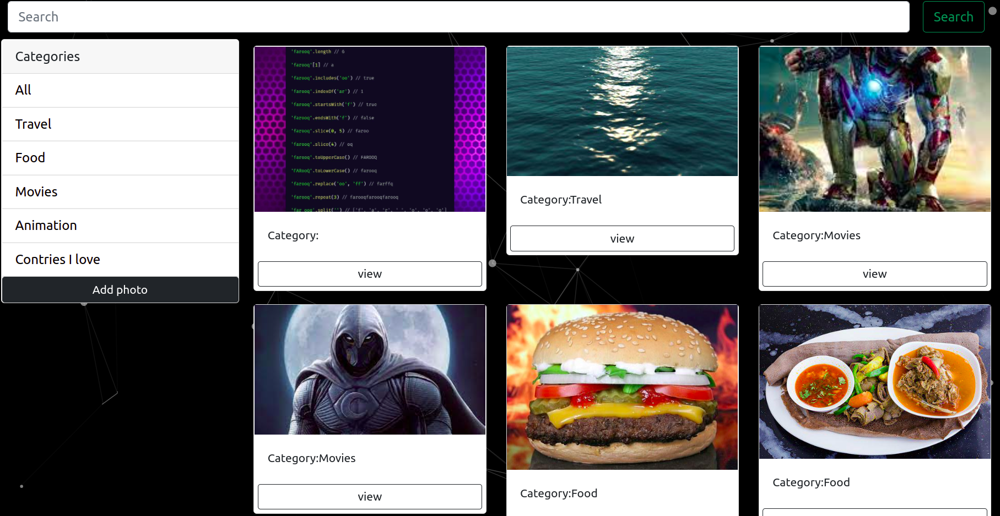
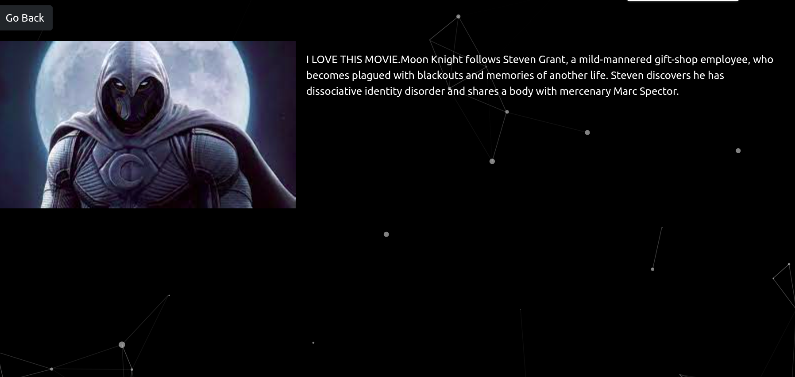
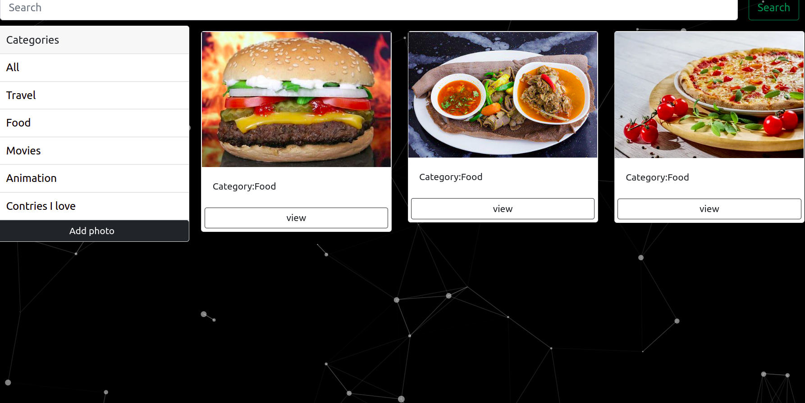

# DJANGO1-Personal-Gallery

### By Elijah Mwangi Wangu.

## Table of content.

- [Description](#description)
- [Installation requirement](#installation)
- [Technology used](#technology used)
- [Reference](#reference)
- [Licence](#licence)
- [Authors Info](#author-info)

## Description

this is my personal gallary website that adds different kind of photos by category and displays in the home page

## Home Page

## Description page

## Category Page(Food)

## Istallation

<ul>
   <li>go to a location of your liking in your file system choose a root folder and clone this repository  
   https://github.com/elijah-dot/DJANGO1-Personal-Gallery
   </li>
   <li>open a code editor.any will work.</li>
</ul>
 
### Requerements
<ul>
<li>either a computer,smartphone er any coputing devise</li>
<li>An access to the internet</li>
<ul>

### Installation process

[Go back to the top](#DJANGO1-Personal-Gallery)

## Technology used

<ul> 
<li>Html - which was used to build the structure of the pages</li>
<li>css- which was used to style the pages </li>
<li>bootstrap-which was used to make pages and images responsive</li>
<li>Django-which was used to give logic to the website</li>
</ul>

## Behaviour Drriven Development

<ol>
<li>displays all the photos with defferent categories</li>
<li>Displays form for new_category,description,existing categories and file.<ul>
<li>INPUT:"description"</li>
<li>INPUT:"existing categories"</li>
<li>INPUT:"file to be displayed as photo"</li>
<li>INPUT:"new_category"</li>
<li>INPUT:"submit"</li>

<li>OUTPUT:"Displays users photo.</li>

</ul> 
</ol>

## Development

Want to contribute ?
 
<ul>
  <li>clone the repo<li>
  <li>find a root directory of your own in file system</li>
  <li>create a branch</li>
  <li>work on the project</li>
  <li>push to the branch</li>
  <li>create a pull request</li>
</ul>

## licence

copyright (c) [2019] [https://github.com/elijah-dot/DJANGO1-Personal-Gallery/blob/master/LICENSE]

## authors info

linked - [Elijah Mwangi Wangu]
(https://github.com/elijah-dot/DJANGO1-Personal-Gallery)

email - [Elijah Mwangi Wangu]
(elijahwangu91@gmail.com
)